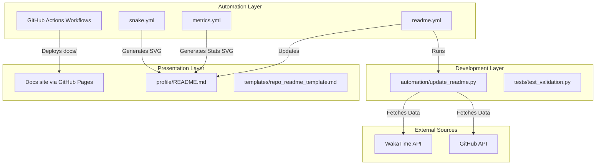

# System Architecture

This document describes the high-level architecture, software layers, components, and data flows of the **GitHub Portfolio System (GPS)**.

---

## 1. System Overview

GPS is designed as a modular developer platform. It decouples your portfolio content (raw data, bios, project files) from the delivery mechanisms (GitHub Profiles, Portfolio Websites, and GitHub Pages). 

---

## 2. Component Design

### Presentation Layer
*   **Profile README (`profile/README.md`)**: The entry-point for visitors of the GitHub profile. Aggregates stats, automated graphics, and bio sections.
*   **Documentation Site (`docs/`)**: A complete documentation website configured via MkDocs and hosted on GitHub Pages.
*   **Repository Templates (`templates/`)**: Standardization templates that ensure all software projects inherit consistent styling, headers, and contributing parameters.

### Automation Layer
*   **Update Engine (`automation/update_readme.py`)**: A Python-based automation controller that calls API endpoints to retrieve language usage, active repository descriptions, and contributions.
*   **Cron Schedules**: Orchestrated via GitHub Actions (`.github/workflows/`) to run daily updates, keeping stats clean and updated without manual intervention.
*   **Security & Health Checkers**: Dependabot and CodeQL keep dependencies secure and ensure python automation scripts do not leak tokens.

### Branding Layer
*   **Brand Guidelines (`branding/`)**: Colors, font families, and SVG layout criteria ensuring light and dark themes render cleanly across devices.

---

## 3. Technology Stack

*   **Logic & Scripts**: Python 3.10+ (using `urllib`, `json`, and `unittest`) for minimal external dependencies and quick startup times in workflows.
*   **Static Site Generator**: MkDocs with the Material theme for modern, high-contrast, responsive documentation.
*   **Workflows**: GitHub Actions YAML config.
*   **Visualization**: GitHub Readme Metrics (SVG templates) and Platane Contribution Snake (dynamic action).
