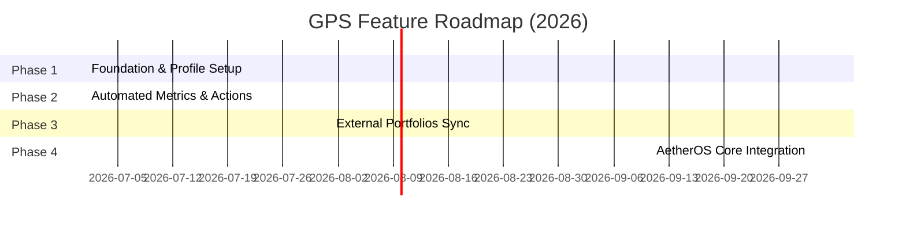

# Future Roadmap

This document outlines the planned enhancements and future integration vectors for the **GitHub Portfolio System (GPS)**.

---

## 🗺️ Execution Phases

---

## Phase 1: Core System (Current)
*   **Recruiter-Grade README**: Full integration of metrics, stats, banners, and layout grids.
*   **Standardized Automation**: Git contribution snake and daily metrics.
*   **Documentation Site**: MkDocs structure deployed to GitHub Pages.

## Phase 2: External Platform Syncing (Q3 2026)
*   **Hugging Face Sync**: Auto-fetch uploaded transformer models, space statuses, and datasets to display on the GitHub profile.
*   **Kaggle Metrics API**: Dynamically list competitive score rankings, notebook views, and gold medals.
*   **LinkedIn Webhook**: Sync work history and achievements from LinkedIn directly.

## Phase 3: AetherOS Core Integration (Q4 2026)
*   **Documentation Host**: Scale the documentation site to host the official guides and APIs for **AetherOS**.
*   **Build Pipeline Check**: Integrate GitHub Actions validation checks to ensure AetherOS OS-level builds compile successfully across platforms.
*   **Docker Hub Integration**: Automate Docker image builds of the AetherOS simulator.
