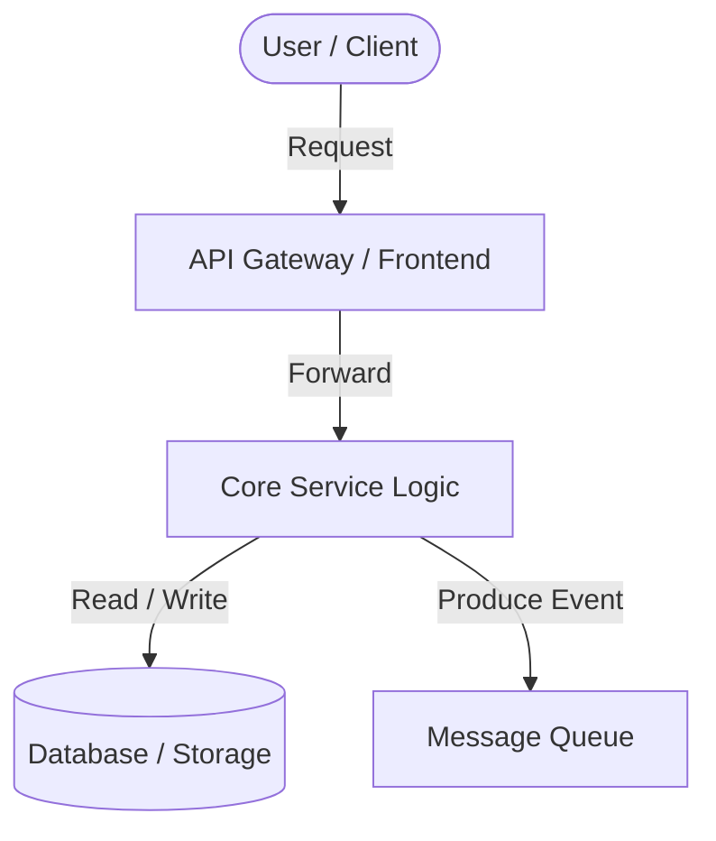

# System Architecture: [Project Name]

This document details the software design, runtime flow, and infrastructure components of **[Project Name]**.

---

## 1. System Components

*   **[Component 1]**: Purpose, data processed, and communication interface.
*   **[Component 2]**: Logic operations, framework dependency, and caching model.
*   **[Component 3]**: Database configuration, log management, and replication.

---

## 2. Component Design & Interactions

---

## 3. Data Flow

1.  **Request Ingestion**: The client sends a request payload.
2.  **Processing**: Core processes the request, validating authentication headers.
3.  **Persistence**: The state transition is logged in the storage database.
4.  **Notification**: An event notification triggers email/alert callbacks.

---

## 4. Key Engineering Decisions

### [Decision A]: Decoupled Components
*   **Why**: Scaling microservices independently.
*   **Trade-off**: Higher setup overhead and latency, mitigated by asynchronous queuing.

### [Decision B]: Database Selection
*   **Why**: Selection of SQL vs NoSQL based on data relational complexity.
*   **Trade-off**: Relational constraints vs. schema flexibility.
